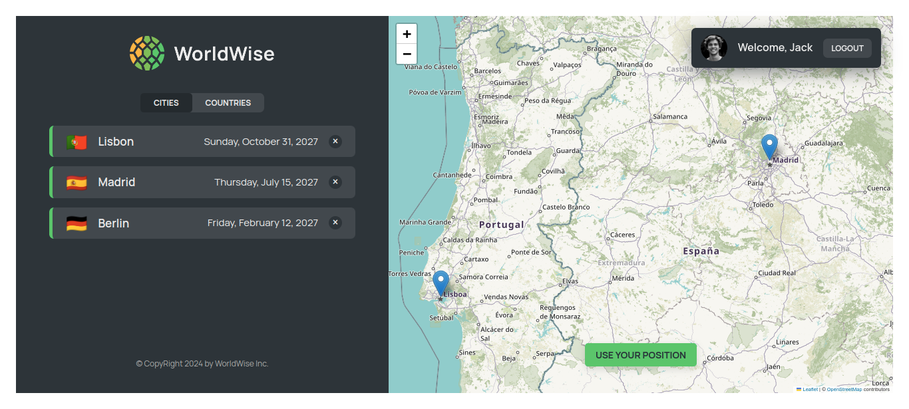

# 🌍 World Wise

Welcome to **World Wise**! This project is a dynamic web application that provides information about cities and countries, utilizing React and modern state management techniques. Explore cities, view details, and interact with a map to enhance your geographical knowledge.

## 🚀 Live Demo

Check out the live demo of the application here: [World Wise Demo](https://world-wise-2193.netlify.app/)

## 🖼️ Screenshots

- **Home Page**
  

- **Cities Page**
  

## 🛠️ Features

- **City List**: Browse through a comprehensive list of cities.
- **City Details**: View detailed information about each city.
- **Map Integration**: Interactive map to visualize city locations.
- **Dynamic Routes**: Navigate between different city details using dynamic routes.
- **Authentication**: Implemented fake authentication for route protection.

## 🔧 Installation

To get started with the project locally:

1. **Clone the Repository:**

   ```bash
   git clone https://github.com/AnasHany2193/world-wise.git
   ```

2. **Navigate to the Project Directory:**

   ```bash
   cd world-wise
   ```

3. **Install Dependencies:**

   ```bash
   npm install
   ```

4. **Run the Development Server:**

   ```bash
   npm run dev
   ```

## 📦 Usage

- **Cities Context**: Manages city data, including fetching, creating, and deleting cities.
- **Map Integration**: Uses Leaflet for displaying and interacting with maps.
- **State Management**: Advanced state management with Context and `useReducer`.

## ❗ Troubleshooting

If you encounter the message **"Your quota limit has been exceeded"**, you might need to use a VPN to bypass the API quota limits.

## 🤝 Contributing

Feel free to open issues or submit pull requests to improve the project. Contributions are always welcome!

## 📫 Contact

For any questions or feedback, reach out via [LinkedIn](https://www.linkedin.com/in/anashany219/).

Happy coding! 🚀
